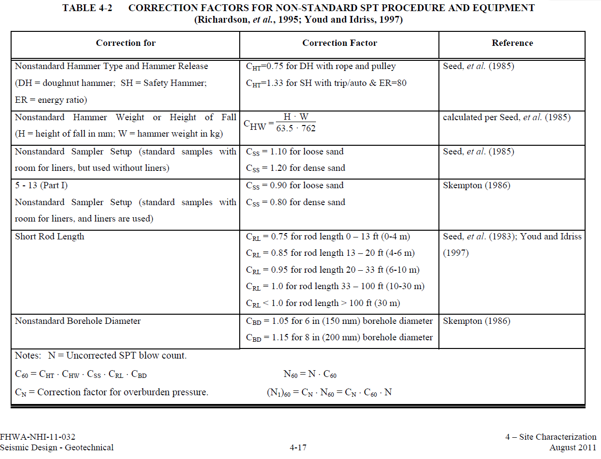
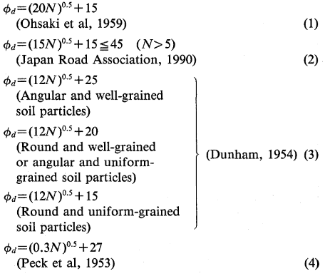

Site Investigation: SPT
========================

Standard sPliT barrel sampler: probabily the most common in situ test.

Fundamental SPT processing
--------------------------

1. Evaluate N60 (standardized SPT blow count)

  - N60 = N * C60
  
    - where, C60 = He * Css * Crl * Cbd
    - He: Hammer Energy factor
    - Css: Sample Setup factor
    - Crl: Rod Length factor
    - Cbd: Borehole Diameter factor
  

   
(image from FHWA, 2011, GEC No. 3)

2. Calculate (N1)60 (normalized to an effective overburden pressure)

  - (N1)60 = N60 * Cn

    - where Cn = 9.79*(1/SVeff)^0.5 (Liao and Whitman,1986)

Engineering parameters from SPT
-------------------------------

- SAND

  - Dr
  
    - Df = ((N1)60/(Cp*Ca*Cocr))^0.5 (Kulhawy and Mayne,1990)
    - Dense SAND: N = 31-50 [bpf] / Dr = 65-85 [%] (Terzaghi and Peck,1948)
  
  
  - phi
  

(image from Hatanaka and Uchida, 1996, Empirical correlation between penetration resistance and internal friction angle of sandy soils)

- CLAY
