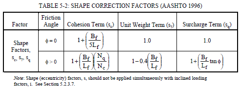
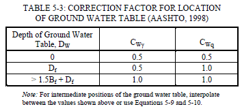
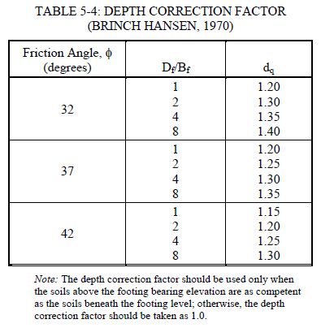

FHWA
--------------------------

- Main Features

  - Equation is same, but a little different order (confusing)
  - almost same as Meyerhof, but has one more correction factor(GWT)
  - Thus, surcharge term q uses **total unit weight** (Not Sure)

- Correction Factors

  - Footing shape
  
    - Strip: sc,sg,sq = (C) 1, 1, 1 / (NC) 1, 0.6 ,1 
    - Square: sc,sg,sq = (C) 1.2, 1, 1 / (NC) 1+(Nq/Nc), 0.6 ,1+tan(phi) 
    
  - Ground water table
  - Embedment depth
  - Sloping
  

   

   

