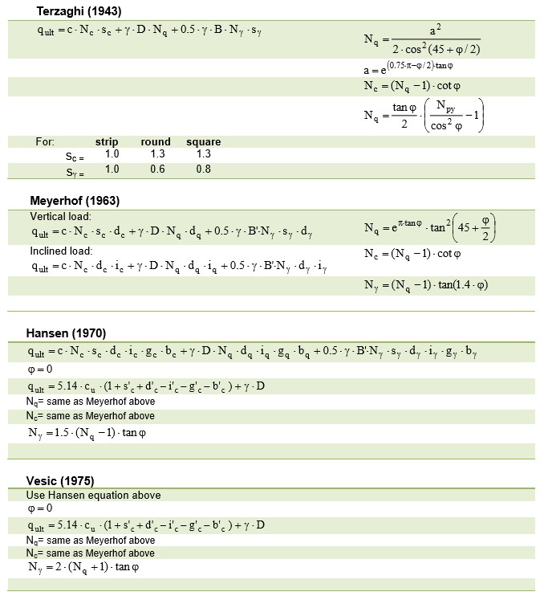
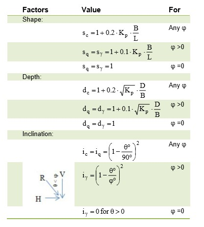
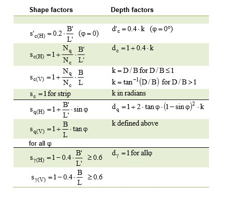

Shallow Foundation Theory
--------------------------

Failure Modes
................................
A failure caused by the vertical and lateral displacement of foundation soils due to lack of sufficient strength is called a "Bearing Capacity Failure".

- General Shear

  : The configuration of the ultimate bearing capacity failure, with well-defined Terzaghi's shear planes developing and extending to the surface, is called "general shear".

- Local Shear

  : In some cases, the failure planes do not extend all the way to the ground surface.

- Punching Shear

  : In some cases, failure involves vertical compression beneath the footing without bulging of the soils.

Tracking previous theories
...........................

(source: https://www.geostru.eu/blog/2016/06/20/bearing-capacity-for-shallow-foundations/?lang=en)

- Terzaghi (1955)

  - q & g terms must be adjusted by ground water table
  - which consider the soil under the footing up to Df + B.
  - Terzaghi introduced **original NcNqNg**, but **no longer used**.
  

- Meyerhof (1963)

  - suggested to add correction factors to Terzaghi approach.
  - Updated NcNqNg table is important and widely used.
  

- Vesic (1975)

