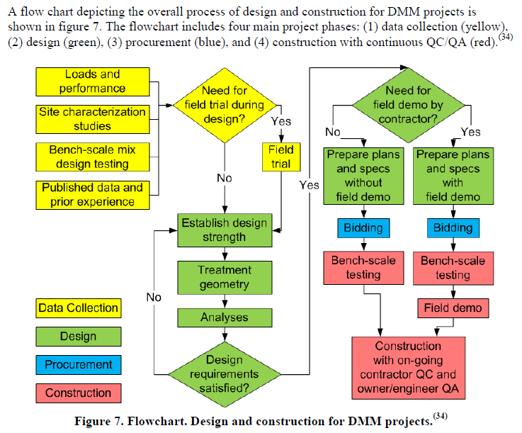

Soil Stabilization
===================

Deep Mixing Method (DMM)
------------------------

What is DMM?
............

: Deep soil mixing or cement deep soil mixing

- Types

  - **Wet Mixing (SAND)**: injecting binders in slurry form to blend with the soil
  
    - Rotary: purely by rotary method (low pressure)
    - Jet: rotary method aided by jet of slurry (high pressure)
    - Vertical: by a chansaw that creates walls or panels

  - **Dry Mixing (CLAY)**: binders in powder form that react with the water already present in the soil

    - Rotary

Why DMM (Pros/Cons)?
.....................

- Ground Treamtment and Improvement

  - Pros: Low cost ( ~ 130 ft) to get design strength (145 psi) / Little vibration / used in most types of soils 
  
  - Cons: Depth limitation / need large working space / underground utilities 

- Liquefaction Mitigation

- Excavation Support Walls

How to plan DMM?
...............

Which parameters should we know?
................................

- Strength

  - Total Water to Binder Ratio (w:c)
  
  - Curing time factor (fc)
  
  - Peak vs Residual
  
- Modulus: E / Secont values of E (E50) / Unconfined compressive strength (qu)

- OthersL Poisson's ratio (v) / Permeability (k) / UnitWeight (UW)
  

