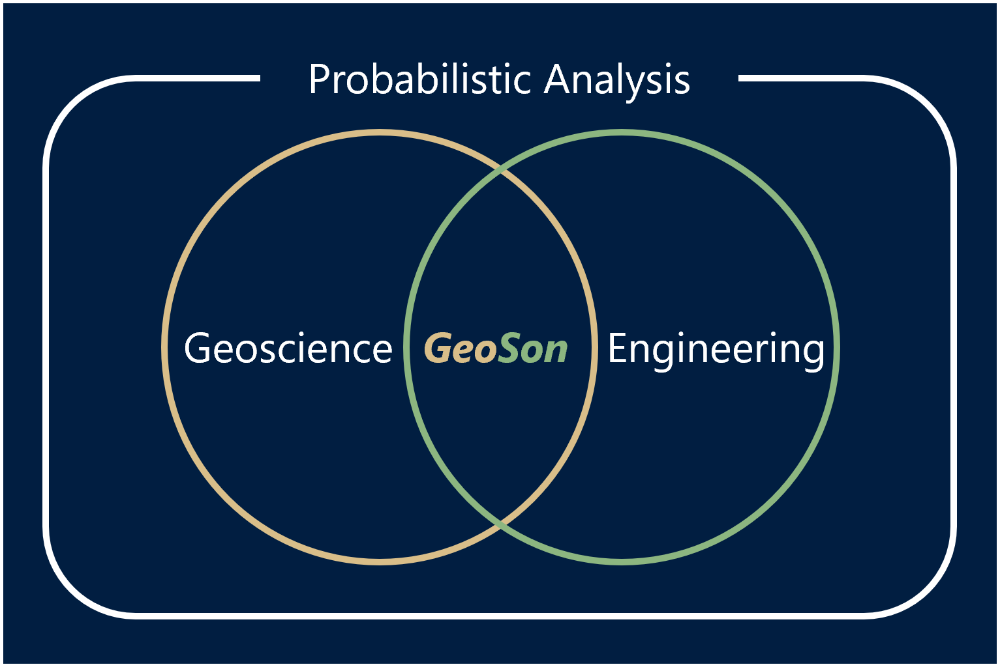

Integrated Geophysics and Geotechnical Engineering (Ditigal Handbooks)
======================================================================

.. toctree::
   :maxdepth: 1
   :caption: Geophysics
   
   IHS_Kingdom <./handbook_for_Kingdom>
   Inversion <./handbook_for_Inversion>
   Integration <./handbook_for_Integration>

.. toctree::
   :maxdepth: 1
   :caption: Offshore Geotechnics
   
   ASTM <./handbook_for_ASTM>
   CPT <./handbook_for_CPT>
   SoilTest <./handbook_for_SoilTest>
   Slope <./handbook_for_Slope>
   Foundation <./handbook_for_Foundation>
   GeoSoftware <./handbook_for_GeoSoftware>

.. toctree::
   :maxdepth: 1
   :caption: Onshore Geotechnics
   
   FHWA <./handbook_for_FHWA>
   Settlement <./handbook_for_Settlement>
   Shallow_Foundation <./handbook_for_Shallow>
   Deep_Foundation <./handbook_for_Deep>
   FEM <./handbook_for_FEM>
   
.. toctree::
   :maxdepth: 1
   :caption: Data Science & Energy Industry
   
   Statistics <./handbook_for_STAT>
   Stochastics (MCMC) <./handbook_for_MCMC>
   Bayesian_Inference <./handbook_for_Bayes>
   Machine_Learning <./handbook_for_ML>
   Offshore_Windfarm <./handbook_for_OWF>

**Contents will be in private repository**
